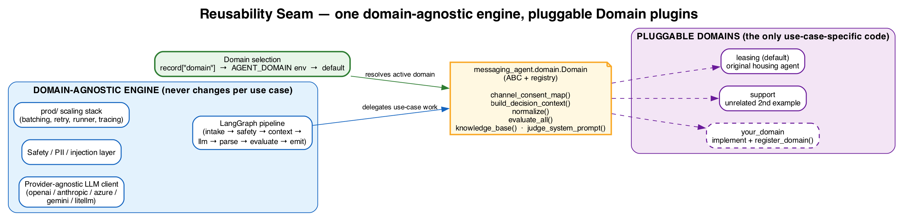
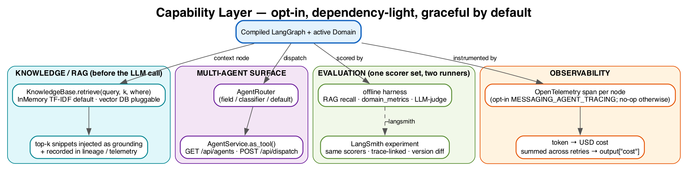
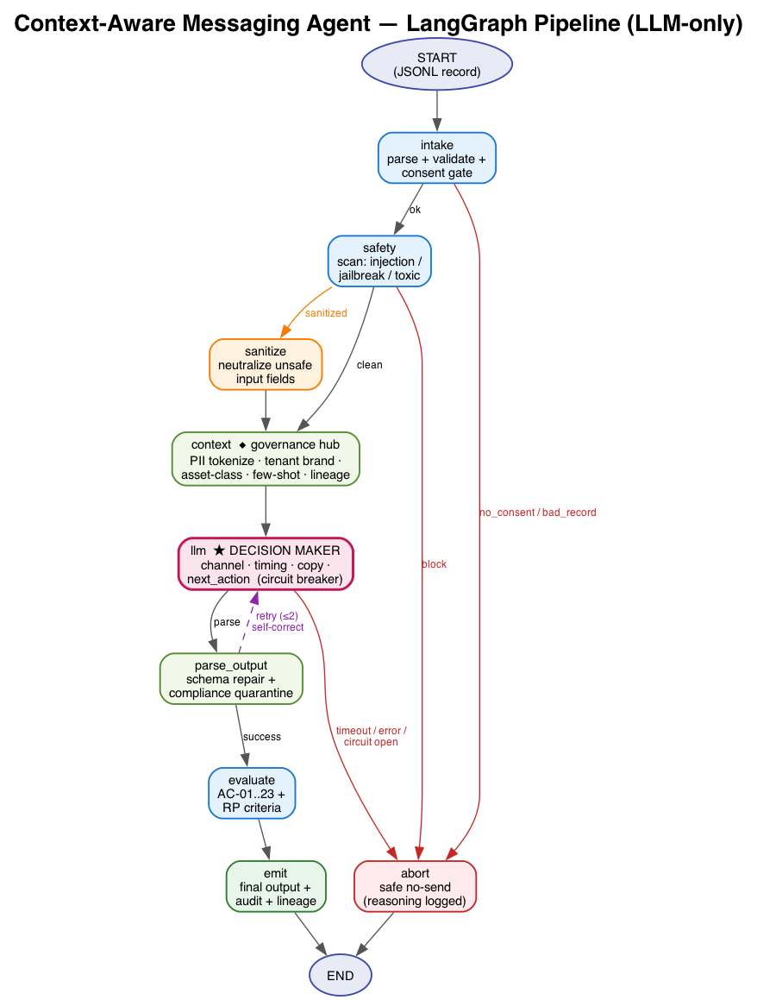
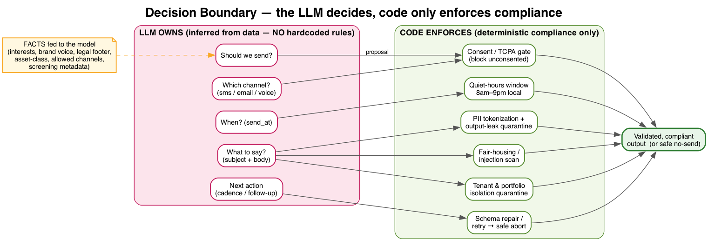
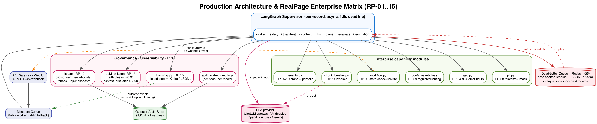
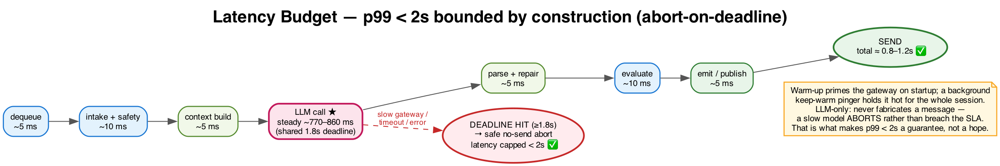

# AgentKit

**A domain-pluggable LLM agent engine** — build production agents where the **LLM makes the decision** and code enforces only compliance. One LangGraph core, many domains.

[](https://github.com/harshapalamoor99/agentkit/actions/workflows/ci.yml)


A production-grade, **domain-pluggable agent engine** built on a **LangGraph state
machine**. Given a structured record (a customer + their consent, preferences, and
context), it decides **whether / how / when / what** to communicate — with the **LLM as
the decision engine** and deterministic code confined to **legal/compliance guardrails**.

Originally a multifamily-leasing agent, it was refactored into a reusable engine: a new
use case is a single `Domain` subclass — the graph, RAG, evals, scaling, and observability
are inherited for free.

> **Why this repo exists:** to demonstrate end-to-end ownership of an LLM agent system —
> from the reasoning/compliance boundary and a hard latency SLA, through evaluation-driven
> development, to production hardening and vendor-neutral observability.

### What this demonstrates

| Capability | Where to look |
|---|---|
| **Clean agent architecture** — graph of small, testable `state→state` nodes | [`graph.py`](src/agentkit/graph.py), [`docs/ARCHITECTURE.md`](docs/ARCHITECTURE.md) |
| **Reusable abstraction** — `Domain` plugin seam; behavior-preserving refactor | [`domain.py`](src/agentkit/domain.py), [`docs/AUTHORING_A_DOMAIN.md`](docs/AUTHORING_A_DOMAIN.md) |
| **Eval-driven development** — multi-layer harness that gates CI + LLM-as-judge | [`evals/harness.py`](src/agentkit/evals/harness.py) |
| **RAG knowledge layer** — pluggable retrieval, tenant isolation, recall@k scoring | [`knowledge.py`](src/agentkit/knowledge.py) |
| **Production hardening** — latency budget, circuit breaker, idempotency, dead-letter | [`nodes/llm.py`](src/agentkit/nodes/llm.py), [`prod/`](src/agentkit/prod/) |
| **Observability + cost** — OpenTelemetry tracing + token→USD accounting | [`observability.py`](src/agentkit/observability.py), [`cost.py`](src/agentkit/cost.py) |
| **Multi-agent + tool-calling** — services, router, OpenAI/Anthropic tool adapters | [`multiagent.py`](src/agentkit/multiagent.py), [`tooling.py`](src/agentkit/tooling.py) |
| **Compliance by construction** — consent, opt-out, PII tokenization, fair-housing veto | [`safety_rules.py`](src/agentkit/safety_rules.py), [`evals/judge.py`](src/agentkit/evals/judge.py) |

> Reading for review: start with **[`docs/ARCHITECTURE.md`](docs/ARCHITECTURE.md)** for the
> design decisions (ADR-style), then `docs/AUTHORING_A_DOMAIN.md` for the extensibility story.

### Quickstart

```bash
pip install -r requirements.txt && pip install -e .

# Run the test suite (fully offline, no API key needed — uses a hermetic mock LLM)
PYTHONPATH=src pytest -q

# Run the evaluation harness over a dataset (scores AC pass-rate, RAG recall, latency…)
PYTHONPATH=src python -m agentkit.evals.cli data/evals/rag_knowledge.jsonl

# Plug in a real LLM by setting any one provider key, then run the interactive console:
#   export OPENAI_API_KEY=...   (or ANTHROPIC_API_KEY / GOOGLE_API_KEY / a LiteLLM gateway)
PYTHONPATH=src python -m agentkit.web
```

---

## How it works

An autonomous, **data-driven** messaging agent built as a **LangGraph multi-agent
pipeline**. Given a JSONL record describing a prospect (profile, preferences,
consent, context, constraints), it decides:

1. **Whether** to communicate (consent gate),
2. **How** (which channel),
3. **When** (timezone-aware, business-hours scheduling),
4. **What** to say (LLM-generated, learned from few-shot examples in the data),

and emits output that semantically matches the `expected` block in the test records.

> **No hardcoded `if persona == X then SMS` rules.** The **LLM is the decision engine** —
> it decides whether to send, which channel, when, what to say, and the next action, by
> reasoning over the record's own fields (consent flags, `channel_preferences`, context)
> and the few-shot `expected` examples. Deterministic code is confined to **legal
> guardrails** (consent enforcement, business-hours/timezone validity, opt-out presence,
> PII/fair-housing scanning) that *validate and minimally repair* the LLM's output —
> never make the business decision.

---

## Reusable engine: domain plugins

This is a **domain-pluggable agent engine**, not a single-purpose script. The LangGraph
pipeline, the provider-agnostic LLM client, the safety/PII layer and the entire `prod/`
scaling stack are **domain-agnostic**. Everything use-case specific — system prompt,
which record fields become "facts", the channel/consent model, output compliance repairs,
and the acceptance criteria — lives behind one interface,
[`agentkit.domain.Domain`](src/agentkit/domain.py).



To reuse the engine for a new use case you implement a `Domain` subclass and register it
— **no change to the core graph, nodes, LLM client or prod layer**:

```python
from agentkit import Domain, DecisionContext, register_domain, available_domains

class MyDomain(Domain):
    name = "my_use_case"
    def channel_consent_map(self): ...
    def build_decision_context(self, *, record, sanitized, tenant, dataset): ...
    def normalize(self, output, state): ...
    def evaluate_all(self, output, record, sanitized): ...

register_domain(MyDomain())
```

Select a domain per record (`{"domain": "my_use_case", ...}`), per process
(`AGENT_DOMAIN=my_use_case`), or programmatically (`set_default_domain(...)`). The bundled
**`leasing`** domain (default) reproduces the original housing agent; **`support`** is a
second, unrelated example driven through the *same* compiled graph
([`tests/test_support_domain.py`](tests/test_support_domain.py)).

📖 Full walkthrough: [`docs/AUTHORING_A_DOMAIN.md`](docs/AUTHORING_A_DOMAIN.md).

### Knowledge / RAG, multi-agent, and domain-aware evals



The engine ships three reusable, dependency-light capabilities (all opt-in, all degrade
gracefully):

- **Knowledge / RAG layer** ([`knowledge.py`](src/agentkit/knowledge.py)) — a
  domain can expose a `KnowledgeBase`; the `context` node retrieves top-k snippets
  *before* the LLM call, injects them as grounding, and records them in lineage +
  telemetry. A pure-python `InMemoryKnowledgeBase` (TF-IDF, zero deps) is the default;
  vector DBs plug in behind the same `retrieve(query, k, where)` interface. Enable for
  leasing with `LEASING_KNOWLEDGE_PATH=kb.jsonl`.
- **Multi-agent surface** ([`multiagent.py`](src/agentkit/multiagent.py)) — each
  domain is a specialized agent over the shared graph. `AgentService` runs one domain or
  exposes it `.as_tool()` for an external orchestrator; `AgentRouter` dispatches a record
  to the right domain (explicit field / classifier / default). HTTP: `GET /api/agents`,
  `POST /api/dispatch`.
- **Domain-aware evals & telemetry** — the harness scores RAG `knowledge.mean_recall`
  (vs. a record's `expected_knowledge_ids`) and merges `domain_metrics`; domains can
  override the LLM-judge rubric (`judge_system_prompt`) and the closed-loop telemetry
  feature vector (`telemetry_features`).
- **Tracing + token/cost accounting** ([`observability.py`](src/agentkit/observability.py),
  [`cost.py`](src/agentkit/cost.py)) — every node runs in an OpenTelemetry span
  (opt-in via `AGENTKIT_TRACING`, no-op otherwise) and every LLM call's tokens are
  priced and summed across retries into `output["cost"]` + lineage. Prices override via
  `LLM_PRICE_TABLE` / `LLM_PRICE_TABLE_PATH`. See `docs/AUTHORING_A_DOMAIN.md`.
- **Hosted evals via LangSmith** ([`evals/langsmith_eval.py`](src/agentkit/evals/langsmith_eval.py))
  — the same scorers as the offline harness, run as a LangSmith *experiment* for
  trace-linked scores and version diffing. No-op without `LANGCHAIN_API_KEY`; run with
  `... --langsmith --dataset NAME --experiment PREFIX`.


---

## Architecture



> **Diagrams** (PNG, source `.dot` in [`docs/diagrams/`](docs/diagrams), render with
> `dot -Tpng -Gdpi=150 <file>.dot -o <file>.png`):
>
> | Diagram | What it shows |
> |---------|---------------|
> | [`pipeline.png`](docs/diagrams/pipeline.png) | LangGraph node/edge flow incl. retry + safe-abort paths |
> | [`domain-plugin.png`](docs/diagrams/domain-plugin.png) | The reusability seam: domain-agnostic engine vs pluggable `Domain` plugins |
> | [`capabilities.png`](docs/diagrams/capabilities.png) | Opt-in capability layer: RAG, multi-agent, evals, observability/cost |
> | [`decision-boundary.png`](docs/diagrams/decision-boundary.png) | What the **LLM decides** vs what **code enforces** |
> | [`context-zoom.png`](docs/diagrams/context-zoom.png) | Inside the `context` node — how the grounded prompt is built |
> | [`enterprise-architecture.png`](docs/diagrams/enterprise-architecture.png) | Production architecture + RealPage RP-01..15 capability map |
> | [`latency-budget.png`](docs/diagrams/latency-budget.png) | Per-stage timing + the abort-on-deadline p99 < 2s guarantee |

```
        intake ──┬─ ok ───────► safety ──┬─ clean ─────────► context ─► llm ──┬─ parse ─► parse
                 ├─ no_consent ─► abort  ├─ sanitized ─► sanitize ─► context  └─ abort ─► abort
                 └─ bad_record ─► abort  └─ block ─────────► abort                │
                                                                                  ▼
        emit ◄── evaluate ◄── (success) ── parse ──┬─ retry ─► llm (within 1.8s budget)
                                                   (no fabrication — slow/failed LLM aborts safely)
```

| Node | Responsibility | Key ACs |
|------|----------------|---------|
| `intake` | Parse + validate record, consent gate | AC-17, AC-18 |
| `safety` | Scan untrusted input for injection / jailbreak / toxic content | AC-16, AC-19, AC-20 |
| `sanitize` | Strip/neutralize unsafe personalization data | AC-16, AC-20, AC-21, AC-22 |
| `context` | Provide *facts* (consented channels, tz, business window, horizon, first_name, interests) + few-shot examples | feeds the LLM |
| `llm` | **Decides** channel/timing/copy/next_action; async w/ shared 1.8s deadline; **aborts safely** (no fabrication) on timeout/error/no-key | latency budget |
| `parse_output` | Extract JSON, **validate & compliance-repair** LLM decisions, re-scan leaks, retry | AC-01..09 |
| `evaluate` | Score all 22 acceptance criteria | all |
| `emit` / `abort` | Final output assembly | AC-13, AC-18 |

State is a shared `MessagingAgentState` TypedDict (see `state.py`). Because each node
is a plain function, the graph supports **retry-with-state** (only the failed `llm`
node loops), and every node's I/O is automatically traceable via LangSmith callbacks.

### Decision boundary (LLM-only; code only for compliance)



- **LLM decides** (learned from data + few-shot examples): whether to send, the
  **channel**, the **send time**, the subject/body/CTA copy, and the **next_action**
  (`start_cadence` vs `follow_up_in_days`). The agent is given *facts* (the consented
  channels, timezone, business-hours window, horizon signals, first_name, interests)
  and reasons over them — it is not handed the answer.
- **Code enforces only legal guardrails** (non-negotiable, not business logic): never
  send on a non-consented channel, schedule only within business hours, require an
  opt-out, strip PII, fair-housing scan, sanitize injection. When the LLM's output
  violates one of these, the parser **repairs minimally and records an audit warning**
  (e.g. `channel_repair: llm='sms' -> consented='email'`); valid LLM decisions pass
  through untouched.
- **No deterministic fallback / no fabricated messages.** The agent is **LLM-only**: it
  only ever sends copy the model produced. If no LLM is configured, or the call times
  out / errors / exhausts the shared 1.8s deadline, the `llm` node sets an `abort_reason`
  (`LLM_UNAVAILABLE`, `LLM_TIMEOUT`, `LLM_BUDGET_EXHAUSTED`, `LLM_ERROR:*`) and the graph
  routes to a **safe no-send abort** (`should_send: false`, audit-logged). This is what
  guarantees **p99 < 2s by construction** — a slow model aborts rather than breaching the
  SLA or inventing a message.

---

## Install & run

```bash
python -m venv .venv && source .venv/bin/activate
pip install -r requirements.txt

# Run the provided sample
PYTHONPATH=src python -m agentkit.cli data/evals/sample_8613.jsonl --out results.jsonl

# Run the adversarial / robustness suite (AC-16..22)
PYTHONPATH=src python -m agentkit.cli data/evals/adversarial.jsonl --verbose
```

### Web UI (interactive test console)
A browser console to paste/edit a record and watch the agent decide live —
shows the channel/timing/copy decision, every acceptance criterion pass/fail,
and the compliance-repair audit warnings. Sample + adversarial records are
preloaded as presets. A second **Batch (JSONL)** tab lets you drag-and-drop or
paste a whole `.jsonl` file and get a per-record pass/fail table plus an
aggregate summary (records, AC passed, critical-fail records, send/no-send
counts, max latency).

```bash
PYTHONPATH=src python -m agentkit.web        # serves http://127.0.0.1:8000
# custom port:
PYTHONPATH=src uvicorn agentkit.web:api --port 8765
```

### Plugging in a real LLM
The client auto-detects the provider from environment variables — no code change:

| Provider | Env var(s) |
|----------|-----------|
| LiteLLM gateway (OpenAI-compatible) | `LITELLM_API_KEY` + `LITELLM_API_BASE` + `LITELLM_MODEL` |
| Anthropic Claude | `ANTHROPIC_API_KEY` |
| OpenAI | `OPENAI_API_KEY` |
| Azure OpenAI | `AZURE_OPENAI_API_KEY` + `AZURE_OPENAI_ENDPOINT` (+ `AZURE_OPENAI_DEPLOYMENT`) |
| Google Gemini | `GOOGLE_API_KEY` or `GEMINI_API_KEY` |

```bash
# Example: a LiteLLM proxy fronting any backend model
export LITELLM_API_KEY=sk-...
export LITELLM_API_BASE=https://your-gateway/v1
# Use the BARE model id the gateway exposes (GET /v1/models) — no "openai/" prefix.
export LITELLM_MODEL=gemini-2.5-flash-lite-genaicenter-us
PYTHONPATH=src python -m agentkit.cli data/evals/sample_8613.jsonl
```

```bash
export ANTHROPIC_API_KEY=sk-...
PYTHONPATH=src python -m agentkit.cli data/evals/sample_8613.jsonl
```

If **no key** is present (or the call times out / errors / exhausts the 1.8s deadline),
the agent does **not** fabricate a message — it is **LLM-only**. The `llm` node sets an
`abort_reason` and the graph routes to a **safe no-send abort** (`should_send: false`,
audit-logged). A live LLM is therefore required to send; this is what guarantees
**p99 < 2s** — a slow model aborts rather than breaching the SLA.

> **Warm-up:** the CLI / eval harness / web UI prime the gateway connection on startup
> (`LLMClient.warmup()`) so the first record isn't penalized by a cold connection.
>
> **Keep-warm (demos / low traffic):** the gateway connection + model go cold after a
> few seconds idle, so the first request after a pause pays a cold-start penalty. Set
> `KEEPWARM_ENABLED=1` (optionally `KEEPWARM_INTERVAL_S=15`) and the web UI starts a
> background pinger (`LLMClient.start_keepwarm()`) that issues a tiny request whenever
> the client has been idle past the interval — holding latency at the warm ~0.8s for the
> entire session. Real traffic resets the idle timer, so it only fires during pauses.
> Leave it **off** for steady production traffic (which keeps itself warm). In code:
> `client.start_keepwarm()` / `await client.stop_keepwarm()`.

Override the model with `AGENTKIT_MODEL=...`.

> **Model id gotcha (LiteLLM gateways):** set `LITELLM_MODEL` to the *bare* id the
> gateway advertises (`curl $LITELLM_API_BASE/models`). A routing prefix such as
> `openai/<model>` makes the gateway answer `team not allowed to access model`
> (HTTP 403 → the agent reports `LLM_ERROR:PermissionDeniedError`).

---

## Enterprise / production-grade matrix (RealPage RP-01 .. RP-15)



Beyond the 22 functional ACs, the agent implements the full RealPage production
acceptance matrix. The **LLM still owns every decision** — these additions only feed
the model more *facts/instructions* or add deterministic *compliance validation* (the
parser quarantines any output that leaks), never hardcoded business rules.

| RP | Capability | Where |
|----|-----------|-------|
| RP-01 | Schema/contract adherence + self-correction retry | `parse_output.py` (retry loop → abort, no fabrication) |
| RP-02 | p95 latency < 2000ms | shared 1.8s deadline, abort-on-timeout |
| RP-03 | TCPA consent enforcement | `channels.py` + intake veto |
| RP-04 | TCPA quiet-hours (8am–9pm local) + tz from ZIP/area-code | `geo.py`, `timing.enforce_quiet_hours` |
| RP-05 | Fair-housing scan | `safety_rules.has_toxic` |
| RP-06 | State mutation / message cancellation | `workflow.py` (`WorkflowEngine`) + `/api/webhook` |
| RP-07 | Multi-tenant brand isolation | `tenants.py` + `context.py` (brand voice / legal footer injected per tenant) |
| RP-08 | PII masking / zero-trust + output-leak quarantine | `pii.py` (`tokenize_record`, `output_reflects_raw_pii`) |
| RP-09 | Asset-class routing (regulated → no pricing incentives) | `config.REGULATED_ASSET_CLASSES`, `parse_output` strip |
| RP-10 | Antitrust / portfolio isolation (no competitor property names) | `tenants.foreign_property_names` + parse-output quarantine |
| RP-11 | LLM circuit breaker + graceful degradation to no-send | `circuit_breaker.py` |
| RP-12 | Decision lineage (prompt version, few-shot ids, token usage, input snapshot) | `context.py` lineage + `llm_client` token capture |
| RP-13 | Semantic-accuracy eval gates (LLM-as-judge) | `evals/judge.py` (faithfulness ≥ 0.95, context_precision ≥ 0.90) gated in `harness.py` |
| RP-14 | Adversarial / prompt-injection resilience | `safety_rules` + sanitize node |
| RP-15 | Closed-loop telemetry (Kafka or JSONL) | `telemetry.py` + `/api/webhook` |

Run the enterprise scenarios (affordable/LIHTC recert, multi-tenant, cross-tenant bait,
late-night quiet-hours) and score them with the RP evaluators:

```bash
PYTHONPATH=src python -m agentkit.cli data/evals/enterprise.jsonl
PYTHONPATH=src python -m pytest tests/test_realpage.py -q
```

Behavioral/infra criteria (RP-06 state cancellation, RP-11 breaker, RP-15 telemetry)
have dedicated unit tests; output-evaluable criteria are scored per record in
`realpage_criteria.py`.

---

## Acceptance criteria

📋 **Full criteria reference:** [`docs/ACCEPTANCE_CRITERIA.md`](docs/ACCEPTANCE_CRITERIA.md)
— both AC sets, severity, where each is implemented, and how each is verified.

All **22 criteria** (AC-01 .. AC-22) are encoded as evaluators in `criteria.py` and
run on every record. Both datasets currently pass **all** criteria:

```
data/evals/sample_8613.jsonl   → 2/2 records, 44/44 AC
data/evals/adversarial.jsonl   → 7/7 records, 154/154 AC
```

Categories: channel selection, timing, content, safety (PII + fair housing),
personalization, next-action, ground-truth match, and the adversarial set
(prompt injection, malformed input, no-consent, jailbreak, toxic personalization,
oversized/garbage input, encoding injection).

---

## Tests

```bash
PYTHONPATH=src python -m pytest -q
```

44 tests cover the full pipeline, channel/timing logic, sanitization, every
adversarial AC, the eval harness, and the production layer (idempotency, cache,
runner, audit). `tests/test_realpage.py` adds 18 tests for the RP-01..15 enterprise
matrix (quiet hours, geo tz, PII tokenization, tenant isolation, asset-class routing,
state cancellation, circuit breaker, lineage, telemetry). **62 tests** total, all
hermetic against a mock LLM (`tests/_mock_llm.py`, installed via an autouse `conftest`
fixture) — no network, no provider keys.

---

## Evaluation harness

Beyond the inline ACs, a dedicated harness scores **semantic match to ground truth**
and the **declared per-record thresholds**, with optional LLM-as-judge quality scoring.

```bash
PYTHONPATH=src python -m agentkit.evals.cli data/evals/sample_8613.jsonl --report report.json
PYTHONPATH=src python -m agentkit.evals.cli data/evals/sample_8613.jsonl --judge   # quality layer
```

It reports and **gates** on:

| Metric | Source | Threshold |
|--------|--------|-----------|
| AC pass rate + critical fails | `criteria.py` | 0 critical fails |
| Semantic match vs `expected` | `evals/semantic.py` (channel/cta/next_action exact + body/subject similarity) | — |
| Personalization score | `evals/personalization.py` | `personalization_score_min` |
| p95 latency (measured) | harness timing | `p95_latency_ms` |
| Output safety violations | PII / fair-housing / injection re-scan | `safety_violations_max` |
| Reply-classification macro-F1 | `evals/reply_classifier.py` | `reply_classification_f1_min` |
| LLM-as-judge quality | `evals/judge.py` (heuristic w/o key) | advisory |

Current results: sample **AC 44/44, semantic 0.913, personalization 1.0, p95 < 10ms,
reply-F1 1.0, 0 breaches**; adversarial **AC 154/154, 0 breaches**.

---

## Production scaling (implemented, runnable)

The same node functions back a real concurrent runner and a Kafka worker. All
infra integrations **degrade gracefully** — they run in-memory/file without infra and
switch to Redis/Kafka/Postgres purely via environment variables.

```bash
# Concurrent batch runner (structured JSON logs + audit + cache + idempotency)
PYTHONPATH=src python -m agentkit.prod.runner data/evals/sample_8613.jsonl --concurrency 32

# Kafka worker — falls back to stdin mode when no Kafka cluster is configured
PYTHONPATH=src python -m agentkit.prod.worker < data/evals/sample_8613.jsonl
```

| Concern | Module | Local (default) | Prod (env-activated) |
|---------|--------|-----------------|----------------------|
| Concurrency | `prod/runner.py` | `asyncio.Semaphore` fan-out | same, per worker pod |
| Idempotency / dedup | `prod/idempotency.py` | in-process | Redis (`REDIS_URL`) |
| Response cache | `prod/cache.py` | in-process LRU | Redis (`REDIS_URL`) |
| Audit store | `prod/audit.py` | `audit.jsonl` | Postgres (`DATABASE_URL`) |
| Tracing | `prod/tracing.py` | off | LangSmith (`LANGCHAIN_*`) |
| Structured logs | `prod/logging_config.py` | JSON to stderr | ship to ELK/Loki |
| Queue / scale-out | `prod/worker.py` | stdin | Kafka (`KAFKA_BOOTSTRAP_SERVERS`) |

**Measured:** with a real LLM, latency is dominated by the model call. Against the
LiteLLM/Gemini-flash-lite UAT gateway (`reasoning_effort:none`, trimmed prompt,
`max_tokens=400`, warmed connection) the end-to-end p99 measured **~1.0s** (p50 ~0.85s,
15/15 records sent under SLA). You scale horizontally by adding Kafka partitions /
worker pods. Few-shot examples are capped (`prompts.build_examples_with_ids`, default 3)
— the curated golden set, never live traffic.

Relevant env vars:

```bash
REDIS_URL=redis://host:6379/0           # idempotency + cache -> Redis
DATABASE_URL=postgresql://...           # audit -> Postgres
KAFKA_BOOTSTRAP_SERVERS=broker:9092     # worker -> Kafka consume/produce
LANGCHAIN_TRACING_V2=true               # + LANGCHAIN_API_KEY, LANGCHAIN_PROJECT
CONCURRENCY=32
# Latency budget (override per environment / gateway speed):
LLM_TIMEOUT_S=1.6                       # cap on a single LLM attempt
TOTAL_LLM_BUDGET_S=1.8                  # cap across all retries (bounds p99 < 2s)
LLM_MAX_TOKENS=400                      # output cap (smaller = faster)
LLM_REASONING_EFFORT=none               # disable Gemini "thinking" tokens
```

### Latency: the 2s SLA is bounded *by construction*



The pipeline enforces a **shared per-request time budget** (`TOTAL_LLM_BUDGET_S`,
default 1.8s) that spans *all* LLM attempts including the retry loop — each attempt
waits at most `min(LLM_TIMEOUT_S, remaining_budget)`. On exhaustion / timeout / error
the `llm` node **aborts to a safe no-send** (it never fabricates a message). So no path
(slow model, retries, parse failures) can exceed ~1.8s of model time + a few ms of
orchestration. Measured (`tests/test_latency.py`, hermetic mock):

| Path | Latency | < 2s |
|------|---------|------|
| Fast valid LLM (50ms) | ~60ms, **sends** | ✅ |
| Slow LLM (3s) → **aborts** safely | <1.8s, no-send | ✅ |
| Unparseable + slow → **retry loop** → abort | <1.8s, no-send | ✅ |
| No provider configured → **aborts** | ~0ms, no-send | ✅ |

Live against the UAT gateway: **p99 ~1.0s** when the gateway is healthy; on a slow
gateway window, records abort (safe no-send) rather than breach 2s. The eval harness
also **measures real wall-time p95 and gates** on each record's `p95_latency_ms`.

---

## Layout

```
src/agentkit/
  state.py          # shared LangGraph state schema
  graph.py          # StateGraph wiring (entry point: `app`)
  domain.py         # Domain plugin interface + registry (reusability seam)
  domains/          # bundled domains: leasing (default), support (example)
  knowledge.py      # RAG knowledge layer (KnowledgeBase + in-memory TF-IDF retriever)
  multiagent.py     # AgentService + AgentRouter (run/expose/route domain agents)
  tooling.py        # OpenAI/Anthropic tool-calling adapters for domain agents
  observability.py  # OpenTelemetry node tracing (opt-in, no-op by default)
  cost.py           # token -> USD cost accounting (overridable price table)
  routing.py        # conditional-edge routers
  channels.py       # data-driven channel selection (AC-01/02)
  timing.py         # tz-aware business-hours scheduling (AC-03/04)
  safety_rules.py   # injection/jailbreak/toxic scan + sanitization
  criteria.py       # all 22 acceptance-criteria evaluators
  prompts.py        # system prompt + few-shot example builder (learns from data)
  llm_client.py     # provider-agnostic async client (auto-detect + warmup)
  cli.py            # JSONL runner + scoreboard
  nodes/            # one module per graph node
  evals/            # semantic match, personalization, reply-F1, judge, harness
  prod/             # runner, worker, idempotency, cache, audit, logging, tracing
data/               # canonical_examples.jsonl (runtime few-shot pool)
  evals/            # labeled eval datasets + generators (see data/evals/README.md)
tests/              # pytest suite
```

## Production scaling (notes)
The node functions drop into a Kafka-fed worker pool: partition `messaging.requests`
by `task_id`, run one compiled graph per worker, and cache LLM responses in Redis keyed
by a profile fingerprint. LangSmith provides node-level traces/latency for the audit
trail; Prometheus/Grafana cover p95 latency and cache hit rate. See the
**Production scaling (implemented, runnable)** section above for the working code.

---

## Documentation

- **[docs/ARCHITECTURE.md](docs/ARCHITECTURE.md)** — design decisions (ADR-style), trade-offs, and the testing strategy.
- **[docs/AUTHORING_A_DOMAIN.md](docs/AUTHORING_A_DOMAIN.md)** — how to plug in a new domain; RAG, evals, observability, tool adapters, and LangSmith.
- **[docs/ACCEPTANCE_CRITERIA.md](docs/ACCEPTANCE_CRITERIA.md)** — the full acceptance-criteria catalog.
- **[data/evals/README.md](data/evals/README.md)** — the labeled evaluation datasets.

## License

MIT — see [LICENSE](LICENSE).

Authored by **Harsha Palamoor**.
